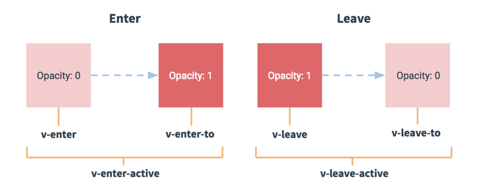

## JS常见的对象迭代方法

```js
// for...of主要是给与迭代器规范的数据消费的,得到的是值
for (let value of 'hello') {
  console.log(value) // h,e,l,l,o
} 

// for...in一边用来遍历对象，也可以遍历数组，得到的是键
for (let key in {name: 'zs'}) {
  console.log(key) // name
}

// Object.keys、Object.values、Object.entries
Object.keys返回的是以键组成的数组
Object.values返回的是以值组成的数组
Object.entries返回的是以键、值为数组元素，键值对为数组组成的数组
```

---

## DOM更新

```jsx
// DOM更新的是异步的，在一开始就要进行操作可以在mounted钩子中使用
mounted () {
  this.$refs.myInput.focus()
}
#DOM更新是异步操作，每次更新数据会有缓存队列的东西，	如果一个方法里更新了数据100次，那么DOM更新也只会有一次
// 常用的方式有vue提供的$nextTick、promise和延迟器等
```

---

## 点击事件传参

```jsx
// 如果给事件加了括号，传递了参数，那么原始的事件类型就没有了，如果又想传递一个普通参数，又想传递一个事件类型
<button v-on:click="handler(123, $event)">点击事件</button>
methods: {
  handler (e, a) {
    console.log(e), // 123
    console.log(a) // 事件类型
  }
}
```

---

## class和style绑定

```jsx
:class="{ 类名: 条件 }"

// 行内
:style="{ color: active, fontSize: fontSize + 'px'}"
```

---

## v-if和v-show

```jsx
// v-if 操作的是结构的创建和销毁，而v-show是操作的是结构的显示与隐藏
#最好不要一起使用，可以拆开使用。或者使用计算属性代替v-if
```

---

## 计算属性

```js
1.computed和data平级
2.语法为 方法名: function() {} 最好不要传参
3.业务逻辑必须要有return值
4.使用时直接使用方法名即可
5.当里面的业务逻辑发生变化时即会触发该函数并计算出新的结果
6.具有缓存性质，如果没有发生变化则不会执行直接拿缓存的数据
```

---

## 侦听器

```js
1.watch和data平级
2.语法为 监听的数据： function(val) {} 可以传参
3.触发了侦听器后会进行里面的业务逻辑
4.还有其他语法为 
  a.要监听的数据: '方法名'
  b.要监听的数据: {handler: function() {}}
  c.在b的基础上有俩个属性
    1.deep 为true时开启深度监听，不论其被嵌套的多深都会被监听到
    2.immediate 为true时会在侦听开始时立即被调用
```

---

## sync修饰符

```jsx
// 用来做属性绑定和事件绑定的
// 特点： 若属性绑定是count,那么对应的事件要写update: count

//父组件中属性绑定和事件绑定
<Component :count.sync="count" />

// 子组件中通过$emit触发
handler () {
  this.$emit('update:count', this.count + 1)
}
```

---

## 对象上的添加或者删除

```jsx
// 在vue中，在对象上属性的添加和删除是加不进去的，不会把数据进行一个响应式的处理。可以使用$set或者vue.set
this.$set(对象名，'键'，'值')

#键和值要用引号包起来

// 在数组里，对项的修改，不能通过索引号直接修改，也要通过$set或者vue.set，才能进行响应式的变化
vue.set(数组名, '索引号', '修改的值')
```

---

## vue中可以进行响应式的数组方法（变异数组）

```js
push
pop
shift
unshift
splice
sort
reverse
```


---

## 依赖注入

```jsx
// 当父组件向孙组件传值时，不用向子组件传递
// provide允许我们指定我们想要提供给后代组件的数据/方法
provide: function () {
  return {
    // 要传递的值
  }
}

// 孙组件通过inject接收
inject: ['接收的值']
```

---

## $attrs(继承所有父组件属性)

```jsx
// 同样是父组件向孙组件传值没必要向子组件传递的情况，会把父组件向子组件传递的值通过对象的方式存储起来
// 父组件A 代码如下
<template>
   <div>
     <child-b :name="name" :sex="sex" />
   </div>
</template>
<script>
   import childB from "./ChildB.vue";
   export default {
    name: 'parA',
     data() {
        return {
          name:"zs",
          sex:"男"
        }
     },
     components:{childB },
   }
</script>

// 子组件child-b 代码如下
<template>
   <div>
    <div>{{name}}</div>	<!-- zs !-->
    <div>{{$attrs.sex}}</div>
    <!-- 通过v-bind 绑定$attrs属性，C组件可以直接获取到A组件中传递下来的props（除了B组件中props声明的） --> 
     <child-c v-bind="$attrs" v-on="$listeners">  </child-c>
   </div>
</template>
<script>
   import childC from "./ChildC.vue";
   export default {
     name: 'childB',
     props:["name"]
     data() {
        return { }
     },
     components:{childC },
   }
</script>

// 孙组件child-c 代码如下
<template>
   <div>
      <p>sex:{{$attrs.sex}}</p> <!-- 男 !-->
   </div>
</template>
<script>
export default {
 name:'childC'
}
</script>

#注意：如果组件在接收时通过props接收了，那么$attrs中将不会有该接收的属性，下面的孙组件也不可用过$attrs接收，class和style也不可传递。父组件向子组件传值时，子组件也可以用$attrs.值来接收使用
```

## $listeners

```jsx
// 传递事件时可以通过v-on绑定$listeners来向孙组件传递事件
// 父组件 A
<template>
    <div>
        <Child-b v-on:test1="onTest1" v-on:test2="onTest2"></Child-b>
    </div>
</template>
<script>
import Childb from './child-b';
export default {
    data() {
        return { };
    },
    components: { Childb },
    methods: {
         // child-b 传回来的数据
        onTest1(msg) {
            console.log('test1',msg);
        },

        // child-c 传回来的数据
        onTest2(msg) {
            console.log('test2',msg);
        }
    }
};
</script>

// 子组件b
<template>
    <div class="child-b">
        <!-- Child-c组件中能直接触发test的原因在于 B组件调用C组件时 使用 v-on 绑定了$listeners 属性 -->
        <Child-c  v-on="$listeners"></Child-c>
    </div>
</template>
<script>
import Childc from './child-c';
export default {
    data() {
        return {};
    },
    components: { Childc },
    mounted() {
        this.$emit('test1','嘻嘻');
    }
};
</script>

//在孙子组件c
<template>
    <div class="child-c"></div>
</template>
<script>
export default {
    data() {
        return {};
    },
    mounted() {
        this.$emit('test2','哈哈');
    }
};
</script>

#要在子组件中绑定v-no="$listeners"才可以在孙组件中使用父组件的事件
```

---

## 组件中使用v-model

```jsx
// 组件中可以使用v-model来简化传值的操作
<test v-model="count" />

// 子组件接收的时候默认用value接收，用input传值
props: {
  value: {
    type: Number
  }
}
methods: {
  handler () {
    this.$emit('input')
  }
}

// 可以通过model来修改默认的value和input
export default {
  model: {
    prop: 'valueNumber',
    event: 'updata'
  }
}
```

---

## 动态组件

```jsx
// 导入组件
import ComponentOne from './ComponentOne'
import ComponentTwo from './ComponentTwo'

// 动态组件语法
<component v-bind:is="currentComponent" />

// 在data中初始化currentComponent
data () {
  return {
    currentComponent: ComponentOne
  }
}

// 	在方法中触发更改动态组件的方法
components: {
  ComponentOne,
  ComponentTwo
}
methods: {
  handler: {
      this.currentComponent: 'Component' + 'Two' // 这里动态切换了组件ComponentTwo
  }
}

#使用以上字符串拼接的方式时，得到的是组件标签，那么需要进行注册。但是如果使用一下方式，是不需要注册的，因为我们import导入进来的就是一个组件实例

methods: {
  handler: {
    switch (item.id) {
      case 1:
        this.currentComponent = ComonentOne;
        break;
      case 2:
        this.currentComponent = ComponentTwo;
        break;
      default:
        this.currentComponent = ComponentOne;
    }
  }
}

#keep-alive只对以上方式有效，可以达到缓存的效果
```

---

## keep-alive

```jsx
// 可以缓存组件 component组件的内容将被缓存，不会再次创建和销毁，所以切换回来的时候可以看到缓存的状态，但是在动态组件中有所不同，即如上所讲。
<keep-alive>
	<component></component> 
</keep-alive>

// 使用keep-alive时会多两个钩子函数
activated () {
  // 被缓存组件的钩子函数
}
deactivated () {
  // 缓存组件被销毁的时候的钩子函数
}
```

---

## 递归组件/树形组件的实现（视频）

```jsx
// 原理： 使用递归组件实现结构的显示，函数递归实现子项是否显示
```

---

## ref

```jsx
// 绑定在DOM上可以操纵DOM或者使用其方法
<h1 ref=></h1>

mounted () {
  this.$refs.mychild.abc() // 在mounted中可以获取到DOM节点以操作其方法
}
// 注意不要和v-for一起使用
```

---

## 动画过渡

```jsx
// transition这个组件，可以不写name属性，如果页面里面使用了多个过渡组件，那么就不能区分了，所以一般是写有名称的过渡组件

// 写了name之后，之前默认的v-enter就会变成name + enter
<transition name="">
	<h5 v-if="show">动画展示</h5>
</transition>

.v-enter { // 定义进入过渡的开始状态。
  opacity: 0
}
.v-enter-active { // 定义进入过渡生效时的状态。
  transition:opacity 0.5s
}
.v-enter-to { // 定义进入过渡的结束状态。
  color: red;
  font-size: 30px
}
.v-leave { 
  // 定义离开过渡的开始状态
}
.v-leave-active {
  // 定义离开过渡的开始状态
}
.v-leave-to {
  // 定义离开过渡的结束状态
}
```



```jsx
// 有active的类名可以理解为设置过渡时间的类名，需要监听过渡的属性，比如此处监听的就是opacity
// v-enter就是opacity从0到1
// leave-to就是opacity从1到0

#其中opacity: 1是自动加的，所以我们不用设置。
```

---

## 混入mixins

```jsx
// 新建文件夹mixins,里面创建js文件
export default {
  data () {
    return {
      total: 100
    }
  },
  methods: {
    handler () {
      console.log('这是mixin的方法')
    }
  }
}

// 在需要混入的vue文件
<button @click="handler"></button> // 这里就可以使用mixin的方法了

import mixin from '路径'
export default {
  mixins: [mixin]
}

#会先走mixin的钩子，再走组件自己的钩子。主要的使用场景就是一些功能的抽象封装，代码的解耦。
// vue3中推荐使用内置的setup钩子函数来抽离封装的功能
```

---

## vue中数据劫持的实现

```jsx
// 通过Object.defineProperty()方法实现
let o2 = {}
let p1 = 1 
Object.deineProperty(o2, 'addr', {
  get() {
    if (p1 == 1) {
      return '数据劫持1'
    }else if (p1 == 2) {
      return '修改为2'
    }else {
      return '默认值'
    }
  },
  set(val) {
    p1 = val
  }
})

o2.addr = 123 // 当修改对象的值时，触发set方法，就会把123赋值给p1
console.log(o2.addr) // 默认值 当输出时，触发get方法，根据条件判断返回相应的内容

o2.addr = 2
console.log(o2.addr) // 修改为2

o2.addr = 1
console.log(o2.addr) // 数据劫持1
```

